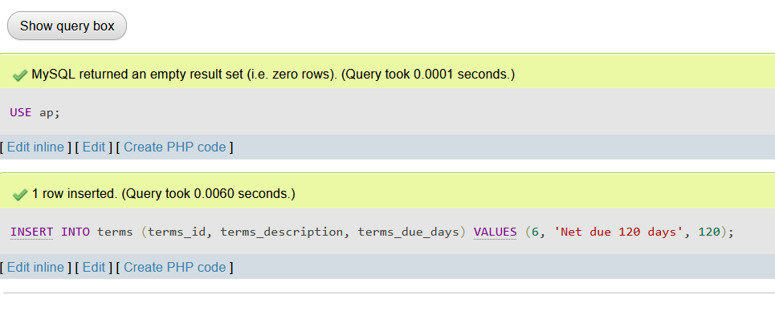

# Ch. 5 Exercises 1-9: SQL Statements and Result Screenshots

## For ch5_ex1.sql:
# The values in the parentheses correspond to the values to be inserted into each of those columns for the new row.
# 
#
## For ch5_ex2.sql:
# This statement changes the terms_description column to "Net due 125 days" and the terms_due_days column to 125 where terms_id is equal to 6.
# 
#
## For ch5_ex3.sql:
# This will delete the row with terms_id equal to 6 from the terms table.
# 
#
## For ch5_ex4.sql:
Inserts the given row into the invoices table with the specified values. The NULL value for the invoice_id column will cause the database to automatically generate a new unique ID for that column.
# 

## For ch5_ex5.sql:
# Assuming the invoice_id generated by MySQL for the invoice added in the previous question is 1, this statement is inserting two rows into the invoice_line_items table. The columns being inserted into are listed after the table name in parentheses. For each row being inserted, the values for each column are enclosed in parentheses and separated by commas.
# 

## For ch5_ex6.sql:
# This statement sets the credit_total column to 10% of the invoice_total column and sets the payment_total column to the remaining amount after deducting the credit_total from the invoice_total.
# 

## For ch5_ex7.sql:
# This will update the row in the Vendors table where the vendor_id is 44 and set the value of the default_account_number column to 403.
# 

## For ch5_ex8.sql:
# This statement uses a subquery to first find the vendor IDs for vendors with a default_terms_id of 2, and then updates the terms_id column in the Invoices table for all invoices that have a matching vendor_id.
# 

## For ch5_ex9.sql:
# The first statement deletes all rows from the invoice_line_items table where the invoice_id matches the maximum invoice_id in the invoices table (which should be the row we just added). The second statement deletes the row from the invoices table with the same maximum invoice_id. The use of MAX(invoice_id) is to ensure that we're only deleting the row we just added, even if there are other rows in the invoices table with higher invoice_id values.
# 
